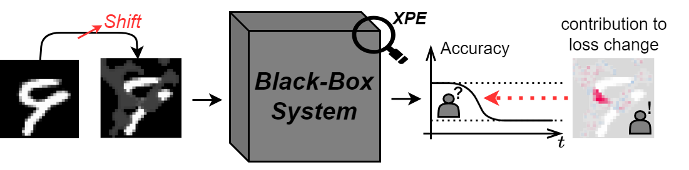

# Explanatory Model Monitoring to Understand the Effects of Feature Shifts on Performance (KDD 2024)

This repository contains code related to the paper ["Explanatory Model Monitoring to Understand the Effects ofFeature Shifts on Performance"](https://doi.org/10.1145/3637528.3671959), published at KDD 2024. 

The code is based on [SHAP](https://shap.readthedocs.io/en/latest/) to compute Shapley Values and [POT](https://pythonot.github.io/index.html) to perform Optimal Transport. 



By combining concepts from Optimal Transport and Shapley Values, we propose a novel approach to explain the behavior of a black-box model under feature shifts. Our method attributs an estimated performance change during deployment to interpretable input characteristics, which enables more informed montoring and maintenance of machine learning models.

In case you find this work useful please cite:

```
@inproceedings{decker2024explanatory,
  title={Explanatory Model Monitoring to Understand the Effects ofFeature Shifts on Performance},
  author={Thomas Decker, Alexander Koebler, Michael Lebacher, Ingo Thon, Volker Tresp, and Florian Buettner},
  booktitle={Proceedings of the 30th ACM SIGKDD Conference on Knowledge Discovery and Data Mining},
  year={2024}
}
```